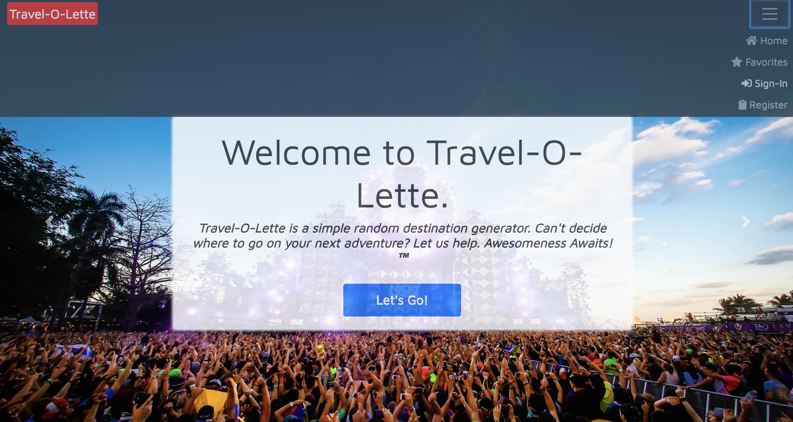
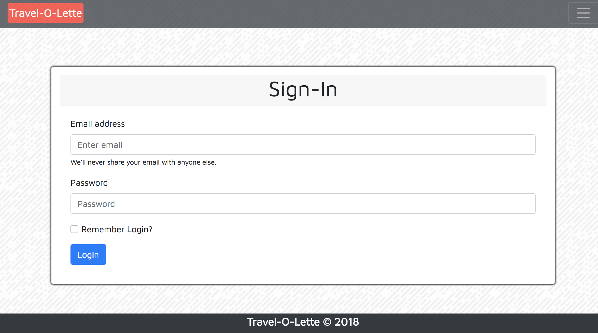
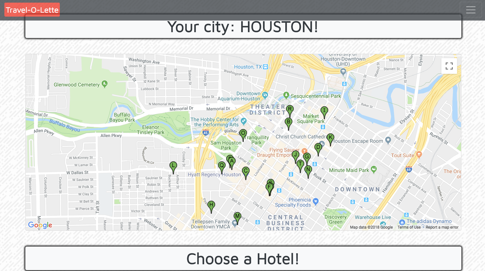
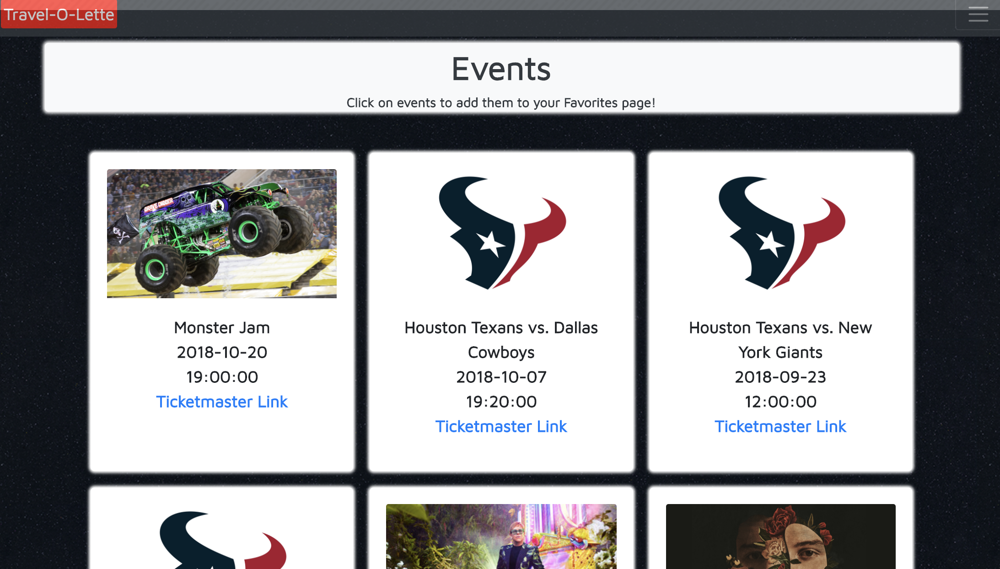
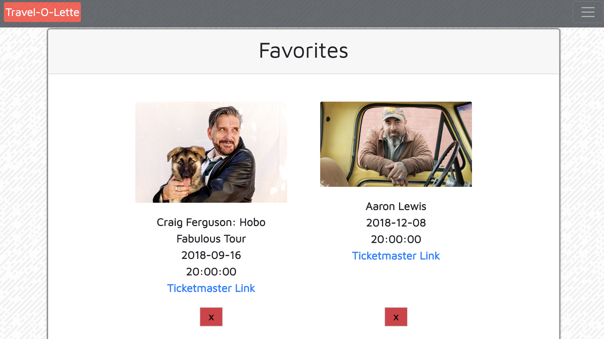

# crash_alderson
https://rgfathrg.github.io/crash_alderson/

# Travel-O-Lette 

A travel app designed to provide a city at random for you to travel to on your next trip. Take the risk and let this app choose your next travel destination. 

  

  

Start by signing in or registering:

  
You'll be taken back to the landing page, where you'll click "Let's Go". A city will be populated,along with local hotels and events. 

  

  
You can favorite the events by clicking on the images, which are then stored on your favorites page. Feel free to remove them as you wish.
  

  

# Technologies Used:
CSS3, HTML5, Javascript, jQuery, FontAwesome, Firebase, Bootstrap
 
# Future Development:
-We plan to add data for the user to access: flights, pricing, date ranges, restaurants, etc.
 
-Create a fully mobile responsive app
 
-Build out front-end design and layout for a better user experience

